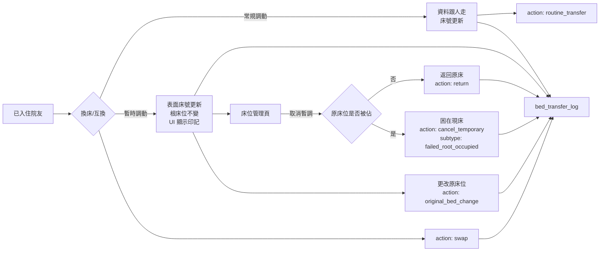

# 床位調動印記與調動日誌 — 佈局圖

> 本文件記錄「常規 / 暫時性床位調動」功能在所有 UI、列印輸出、Excel 匯出與統計報表上的床號顯示政策。

---

## 1. 資料模型

Migration：`supabase/migrations/20260730023032_bed_transfer_imprint_and_log.sql`

```text
patients
├── bed_transfer_type      -- 'routine' | 'temporary' | null
├── original_bed_id        -- 暫時調動時的「根床位」UUID
└── original_bed_number    -- 應用層填充的根床位顯示號

bed_transfer_log
├── patient_id
├── patient_name           -- 院友姓名（直接去正規化，方便查閱）
├── action_type            -- admission | discharge | routine_transfer | temporary_transfer
│                          -- swap | return | cancel_temporary | original_bed_change
├── transfer_subtype       -- 例如 failed_root_occupied
├── from_bed_id / from_bed_number
├── to_bed_id / to_bed_number
├── actor_*                -- 操作者身份
├── group_id               -- 批量/互換時分組
├── created_at
└── 支援單筆刪除（RLS DELETE policy + deleteBedTransferLogEntry）
```

---

## 2. 床號顯示政策

| 場景 | 顯示床號 | 小字/備註 |
|------|----------|-----------|
| 執行層 UI（列表、搜尋、篩選、對話框、操作按鈕） | 現床 `patient.床號` | 暫調者由 `BedNumberImprint` 在現床下方顯示 `原A101-1` |
| 列印 / Excel / HTML 表單 | 原床 `getPrintBedNumber(patient)` | 無額外小字（紙面本身即原床） |
| 床位表列印 | 原床 `patient.original_bed_number \|\| patient.床號` | 暫調者顯示 `(暫A102-2)` 小字 |
| 統計報表（Reports） | 原床 `getPrintBedNumber(patient)` | 無 |
| 搜尋 / 排序 / 篩選 / 分組 key | 現床 `patient.床號` | 操作邏輯不依賴原床 |
| 資料庫 payload / 表單提交 | 現床 `patient.床號` | 儲存的是當前床位 |

### 2.1 工具函數

`apps/web/src/utils/bedTransferUtils.ts`

| 函數 | 用途 |
|------|------|
| `isTemporaryTransfer(patient)` | 判斷是否為暫時調動 |
| `getDisplayBedNumber(patient)` | 取得現床號（執行層顯示） |
| `getRootBedNumber(patient, beds?)` | 取得原床號（印記小字） |
| `getPrintBedNumber(patient)` | 取得列印/報表用原床號；無原床資訊時回退現床 |
| `getRootBedId(patient)` | 取得原床 UUID |
| `enrichPatientsWithOriginalBedNumber(patients)` | 後端未填充時補上原床號 |

### 2.2 印記元件

`apps/web/src/components/BedNumberImprint.tsx`

```tsx
<BedNumberImprint patient={patient} beds={beds} size="md" />
```

- 常規調動：只顯示現床號。
- 暫時調動：現床號下方顯示小字 `原A101-1`。
- 僅供執行層 UI 使用；列印/Excel/統計報表不經由此元件取床號。

### 2.3 日誌工具

`apps/web/src/utils/bedTransferLogUtils.ts`

- `buildBedTransferLogEntry(payload)`
- `formatBedTransferDescription(entry)`
- `ACTION_TYPE_LABELS`、`ACTION_TYPE_STYLES`

---

## 3. 執行層 UI 印記佈局

執行層所有顯示床號的地方仍使用現床，暫調者附加 `原A101-1` 小字。

### 3.1 儀表板與床位管理

| 檔案 | 位置說明 |
|------|----------|
| `pages/Dashboard.tsx` | 各種待辦卡片、清單、統計popover中的院友床號 |
| `pages/StationBedManagement.tsx` | 床位卡片上的院友姓名、床號；暫調標籤；取消/更改原床/日誌按鈕 |
| `nurse/pages/PatientListPage.tsx` | 護理版院友列表床號 |
| `components/PatientInfoCard.tsx` | 院友資訊卡床號 |
| `components/PatientAutocomplete.tsx` | 搜尋建議與已選項目床號 |

### 3.2 院友列表與選擇

| 檔案 | 位置說明 |
|------|----------|
| `pages/PatientRecords.tsx` | 院友列表、匯出/列印對話框 |
| `components/PatientSelectModal.tsx` | 選擇院友加入排程時的床號 |
| `components/PatientQRCodeModal.tsx` | QR Code 彈窗床號 |
| `components/PatientPrintModal.tsx` | 列印院友資料彈窗床號 |
| `components/PatientLogModal.tsx` | 院友日誌彈窗 |
| `components/VaccinationRecordModal.tsx` | 疫苗記錄彈窗 |

### 3.3 記錄頁面

| 檔案 | 位置說明 |
|------|----------|
| `pages/ActivityRecords.tsx` | 活動記錄列表與詳情 |
| `pages/AdmissionRecords.tsx` | 入院記錄 |
| `pages/AnnualHealthCheckup.tsx` | 年度體檢 |
| `pages/Cgat.tsx` | CGAT |
| `pages/DiagnosisRecords.tsx` | 診斷記錄 |
| `pages/FollowUpManagement.tsx` | 覆診跟進 |
| `pages/HealthAssessments.tsx` / `HealthAssessment.tsx` | 健康評估 |
| `pages/IncidentReports.tsx` | 意外事件 |
| `pages/InfectionControl.tsx` | 感染控制 |
| `pages/MealGuidance.tsx` | 餐膳指引 |
| `pages/PatientContacts.tsx` | 院友聯絡人 |
| `pages/PatientLogs.tsx` | 院友日誌 |
| `pages/Scheduling.tsx` | VMO 排程院友列表 |
| `pages/TaskManagement.tsx` | 任務管理 |
| `pages/TubeCareManagement.tsx` | 管道護理 |
| `pages/VaccinationRecords.tsx` | 疫苗記錄 |
| `pages/WoundManagement.tsx` | 傷口管理 |
| `pages/CareRecords.tsx` | 護理記錄 |
| `pages/IndividualCarePlan.tsx` | 個人照顧計劃 |
| `pages/PrintForms.tsx` | 列印表單選擇列表（列表本身仍用現床，列印輸出時用原床） |
| `pages/StaffWorkPanel.tsx` | 員工工作面板 |
| `pages/RestraintManagement.tsx` | 約束管理 |
| `pages/PrescriptionManagement.tsx` | 處方管理 |

### 3.4 常用彈窗與卡片

| 檔案 | 位置說明 |
|------|----------|
| `components/ActivityRecordModal.tsx` | 活動記錄彈窗 |
| `components/ActivityRecordReminderCard.tsx` | 活動記錄提醒卡片 |
| `components/BatchPrescriptionDateUpdateModal.tsx` | 批量更新處方日期預覽 |
| `components/CarePlanDueReminderCard.tsx` | 照顧計劃到期提醒 |
| `components/CarePlanModal.tsx` | 照顧計劃彈窗 |
| `components/CgatPrintWarningModal.tsx` | CGAT 列印確認 |
| `components/DischargeModal.tsx` | 退住彈窗 |
| `components/DocumentTaskModal.tsx` | 文件任務彈窗 |
| `components/DispenseConfirmModal.tsx` / `DispenseReasonModal.tsx` | 派藥確認 |
| `components/EnhancedAdmissionRecordModal.tsx` | 入院記錄彈窗 |
| `components/FailureReasonModal.tsx` | 失敗原因 |
| `components/HealthRecordModal.tsx` | 健康記錄 |
| `components/HygieneModal.tsx` | 衛生記錄 |
| `components/InjectionSiteModal.tsx` / `InjectionWorkflowModal.tsx` | 注射記錄 |
| `components/InspectionCheckModal.tsx` | 派藥前檢測 |
| `components/MedicationRecordExportModal.tsx` | 藥物記錄匯出（對話框列表仍用現床） |
| `components/MedicationRemindersCard.tsx` | 藥物提醒 |
| `components/NotesCard.tsx` | 便條卡片 |
| `components/MissingRequirementsCard.tsx` | 欠缺必要項目卡片 |
| `components/OverdueWorkflowCard.tsx` | 逾期流程提醒 |
| `components/PendingPrescriptionCard.tsx` | 待變更處方提醒 |
| `components/AiAssistant/OpenFormCard.tsx` | AI 開表卡片 |
| `components/ScheduleDetailModal.tsx` | 排程詳情 |
| `components/SingleWoundAssessmentModal.tsx` | 單次傷口評估 |
| `components/CaseConferenceListModal.tsx` | 個案會議 |
| `components/ChangeOriginalBedModal.tsx` | 更改原床位彈窗 |
| `components/BedAssignmentModal.tsx` | 分配床位（常規/暫時選擇） |
| `components/BedSwapModal.tsx` | 床位互換（常規/暫時選擇） |
| `components/BedTransferLogModal.tsx` | 院友調動日誌 / 床位調動日誌彈窗 |
| `components/RecycleBinModal.tsx` | 回收桶 |
| `components/RevertConfirmModal.tsx` | 還原確認 |
| `components/WorkflowActionModal.tsx` / `WorkflowDeduplicateModal.tsx` | 工作流程 |
| `components/PrescriptionActivityLogModal.tsx` | 處方活動日誌 |
| `components/PrescriptionTransferModal.tsx` | 處方轉移 |
| `components/PrnWorkflowModal.tsx` | PRN 流程 |

---

## 4. 列印 / Excel / 統計報表原床號佈局

所有列印、Excel 匯出、HTML 表單與統計報表均使用 `getPrintBedNumber(patient)`，以原床為顯示依據。暫時調動的院友在紙本文件與報表上歸屬於原床。

| 檔案 | 輸出類型 |
|------|----------|
| `utils/activityRecordPrintFormHtml.ts` | 活動記錄紙本 |
| `utils/carePlanPrintGenerator.ts` | 照顧計劃 |
| `utils/cgatWorksheetGenerator.ts` / `cgatMedicationProxyGenerator.ts` | CGAT 工作表 / 代理 |
| `utils/healthAssessmentPrintGenerator.ts` | 健康評估 |
| `utils/hygieneRecordPrintFormHtml.ts` | 衛生記錄 |
| `utils/woundAssessmentPrintGenerator.ts` | 傷口評估 |
| `utils/printIncidentReport.ts` / `incidentReportWordGenerator.ts` | 意外事件報告 |
| `utils/patientReferralPrintGenerator.ts` | 轉介 |
| `utils/erRecordPrintGenerator.ts` | 急症室記錄 |
| `utils/followUpRecordWorksheetGenerator.ts` / `followUpListGenerator.ts` | 覆診 |
| `utils/patientLogNursingTreatmentGenerator.ts` | 院友日誌 |
| `utils/restraintConsentPrintGenerator.ts` / `restraintConsentExcelGenerator.ts` / `restraintUsageRecordPrintGenerator.ts` / `restraintObservationHtmlExporter.ts` / `restraintObservationChartExcelGenerator.ts` | 約束物品 |
| `utils/medicationListHtmlGenerator.ts` / `medicationRecordHtmlExporter.ts` / `medicationRecordExcelGenerator.ts` / `prescriptionExcelGenerator.ts` / `personalMedicationListExcelGenerator.ts` | 藥物 / 處方 |
| `utils/printFormExcelGenerator.ts` | 通用列印表單 |
| `utils/annualHealthCheckupExcelGenerator.ts` | 年度體檢 |
| `utils/bloodSugarExcelGenerator.ts` / `bodyweightExcelGenerator.ts` / `vitalsignExcelGenerator.ts` / `healthRecordExcelGenerator.ts` / `bloodPressureRecordWorksheetGenerator.ts` / `bodyweightRecordWorksheetGenerator.ts` / `glucoseRecordWorksheetGenerator.ts` / `temperatureRecordWorksheetGenerator.ts` | 生命表徵 / 體重 / 血糖 / 血壓 |
| `utils/diaperChangeExcelGenerator.ts` / `personalHygieneExcelGenerator.ts` | 換片 / 個人衛生 |
| `utils/combinedScheduleExcelGenerator.ts` / `vmoSchedulePrintGenerator.ts` / `scheduleDueChecker.ts` | VMO 排程 / 到期提醒 |
| `utils/waitingListExcelGenerator.ts` | 候診名單 |
| `utils/docHtmlGenerators/baseTemplateProcessor.ts` / `nursingAssessmentGenerator.ts` / `personalHealthRecordGenerator.ts` | 文件 HTML 範本 |
| `pages/Reports.tsx` | 每日/月度/感染/餐膳/管道/特殊等統計報表 |

### 4.1 床位表列印特殊處理

`pages/StationBedManagement.tsx` 在列印床位表時構建 `BedListBed`：

- `bed_number`: 院友的原床號（`patient.original_bed_number \|\| patient.床號`）；空床為當前物理床號。
- `current_bed_number`: 僅暫時調動時設為現床號，用於小字 `(暫A102-2)`。

`utils/bedListHtmlGenerator.ts` 的 `renderBedRow` 會在床號後渲染 `current_bed_number` 小字。

---

## 5. 調動流程與日誌



### 5.1 主要實作檔案

| 檔案 | 職責 |
|------|------|
| `context/facility/StationContext.tsx` | `assignPatientToBed`、`swapPatientBeds`、`changeOriginalBed`、`endTemporaryTransfer`、`cancelTemporaryTransfer` |
| `lib/database.tsx` | 底層調動寫入、`getPatients` / `getPatientsWithWounds` 填充 `original_bed_number` |
| `components/BedAssignmentModal.tsx` | 分配床位並選擇常規/暫時 |
| `components/BedSwapModal.tsx` | 互換床位並選擇常規/暫時 |
| `components/ChangeOriginalBedModal.tsx` | 更改原床位 |
| `components/BedTransferLogModal.tsx` | 院友調動日誌 / 床位調動日誌彈窗 |
| `pages/StationBedManagement.tsx` | 床位管理頁：取消暫調、更改原床；screen 層按鈕「床位調動日誌」；床位卡片下拉「院友調動日誌」；日誌記錄可個別刪除 |

---

## 6. 測試

| 檔案 | 說明 |
|------|------|
| `apps/web/src/utils/bedTransferUtils.test.ts` | 常規/暫時判斷、根床位、列印原床號 |
| `apps/web/src/utils/bedTransferLogUtils.test.ts` | 入住、常規/暫時調動、互換、返回原床、取消暫調、更改原床位日誌描述與建構 |

執行：`cd apps/web && npm test`。

---

## 7. 備註

- 搜尋、排序、篩選仍使用 `patient.床號`（現床號），因它們是操作邏輯而非顯示。
- 表單 payload（如 `床號: patient.床號`）保留現床號，因為資料庫儲存的就是當前床位。
- `confirm()` / `alert()` 等對話框文字也保留現床號，避免在純文字中插入 HTML/元件。
- 床位表列印以原床為主，暫調者顯示 `(暫A102-2)` 小字，兼顧「歸根」統計與現場定位。
